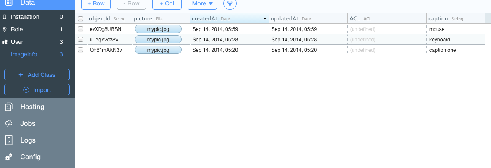

DC Web Women Code(Her) Ionic Framework Sample App
====
##About This Project
This is a simple application that was used to demonstrate the Ionic Framework
 - based off of the tabs sample template
 - uses ngCordova - [http://ngcordova.com/docs/](http://ngcordova.com/docs/)
 - uses Camera plugin - org.apache.cordova.camera
 - uses angular promises implementation [A promise/deferred implementation inspired by Kris Kowal's Q.](https://docs.angularjs.org/api/ng/service/$q)
 - uses Parse.com to save images, also demonstrates the use of the Parse.File object
 - uses the [ui-router resolve functionality](https://github.com/angular-ui/ui-router/wiki#resolve)
 - uses [https://github.com/grrrian/phonegap-parse-plugin](https://github.com/grrrian/phonegap-parse-plugin) - Push Notifications with Parse
 - uses [angular-leaflet-directive](https://github.com/tombatossals/angular-leaflet-directive) for map integration for showing locations of images

The application allows the user to take pictures and save them to a in memory cache or if you set up Parse.com you can save the images to a parse datastore in the cloud. Images are saved with a caption, photo data and a timestamp

##More Images
- [Enter Caption for Photo](https://github.com/aaronksaunders/dcww/blob/master/doc/Screen%20Shot%202014-09-13%20at%208.14.52%20PM.png)
- [List View with Updated Entry](https://github.com/aaronksaunders/dcww/blob/master/doc/Screen%20Shot%202014-09-13%20at%208.14.24%20PM.png)
- [Detail View Showing Photo and Information](https://github.com/aaronksaunders/dcww/blob/master/doc/Screen%20Shot%202014-09-13%20at%208.14.15%20PM.png)

##Installation Steps for Running Project

- It is assumed that you have and Android or IOS development environment installed
- It is assumed you have node and npm installed 
  - [node-and-npm-in-30-seconds.sh](https://gist.github.com/isaacs/579814) 

####High Level Installation Steps 

- Install Ionic [http://ionicframework.com/getting-started/](http://ionicframework.com/getting-started/)
  - this process will download phonegap/cordova for you
  - ngCordova is used, but already included in repo, more information here: [http://ngcordova.com/docs/](http://ngcordova.com/docs/)
  - we will be using angularjs, that is bunded with ionic, see more information on [AngularJS](https://angularjs.org/)
- Download Code from repo
- Add missing bower and node modules
  - enter command `bower update`
  - enter command `sudo npm update -g ionic`
- Add back the plugins that are not included in repo
  - enter command `cordova plugin add org.apache.cordova.camera`
  - enter command `cordova plugin add org.apache.cordova.statusbar`
  - enter command `cordova plugin add org.apache.cordova.console`
  - enter command `cordova plugin add org.apache.cordova.device`
  - enter command `cordova plugin add com.ionic.keyboard`
- Add in the platforms 
  - enter command `ionic platform android`
  - enter command `ionic platform ios`

##Parse Integration as Requested in the workshop
The application demonstrates the use of Angular Services for persistence. There is a Parse implementation, `ParseImageService` and a memory based implementation, `ImageService`. The application currently is configured to use `ParseImageService`; this
requires that you set your own parse credentials in the application.
 
You will need to create an application in Parse.com and create a Custom Object with a field `picture` that is of type `File` and another field `caption` of type `String`.
 
When you browse your data, it should look like this.

 
For additional information, see the Parse.com website for [Getting Started](https://www.parse.com/apps/quickstart#parse_data/web/existing)
 
 
###ImageModel to Support both Interfaces
 The data object that is returned from a parse query is not a simple javascript hash so there was a need to create a model object
 that would convert the objects returned from the default `ImageService` into some object that has the same interface as a Parse.com
 object so we would not need two UI implementations.
 
     /**
      *  This is a helper model that is created to allow the application UI to work with the
      *  local datastore and the parse datastore without modifications
      *
      * @param _params
      * @returns {{id: *, createdAt: *, get: get, set: set}}
      * @constructor
      */
     var ImageModel = function (_params) {
         var _data = {};

         /**
          * initialize object to act like a parse.com object
          
          * @param _params
          * @private
          */
         this.set = function (_params) {

             if (!_params) {
                 return;
             }

             this.id = _params.id;
             this.createdAt = _params.timestamp;

             _data['createdAt'] = _params.timestamp;
             _data.caption = _params.name;
             _data.id = _params.id;
             _data.picture = { _url: _params.data};

         };
         /**
          *
          * @param _key
          * @returns {*}
          * @private
          */
         this.get = function (_key) {
             return _data[_key]
         };

         this.set(_params);

     };
 
####Parse Integration and Basic Local Storage 
 Open the `app.js` file and modify the code below to use your credentials. If you set any of the credentials to an empty string,
 the application will still work, but it will utilize the default image service and not use parse
 
     .value('parseConfiguration', {
         applicationId: "YOUR APPLICATION ID",
         javascriptKey: "YOUR JAVASCRIPT KEY"
        USING_PARSE : true
     })
for  

####Ui-Router and resolve for Parse Integration
This funny looking code for initializing Parse.com that is in `app.js` is the resolve functionality of the ui-router.
You can find additional documentation here [https://github.com/angular-ui/ui-router/wiki#resolve](https://github.com/angular-ui/ui-router/wiki#resolve)

    usingParse: function ($q, $timeout, ParseConfiguration) {

        if (ParseConfiguration.applicationId && ParseConfiguration.javascriptKey) {
            console.log("parse initialize");
            Parse.initialize(ParseConfiguration.applicationId, ParseConfiguration.javascriptKey);
        } else {
            ParseConfiguration.USING_PARSE = false
        }

        return ParseConfiguration.USING_PARSE;

    }
